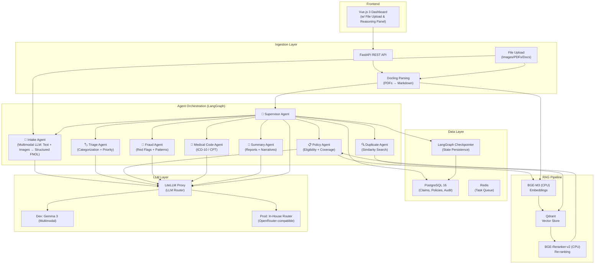

# 🏥 AI Claims Intake System


A production-grade, self-hosted multi-agent system that processes incoming First Notice of Loss (FNOL) incident reports — submitted as **unformatted text and images** — and cross-references them against retrieved policy terms using a LangGraph-orchestrated pipeline.

## ✨ Features

- 🤖 **Multi-Agent Orchestration**: Powered by LangGraph, featuring a Supervisor agent routing tasks to specialized agents (Intake, Triage, Policy, Fraud, Medical, Summary, and Duplicate Detection).
- 👁️ **Multimodal FNOL Intake**: Native LLM vision capabilities (via Gemma 3) process raw text narratives and base64-encoded incident images (handwritten notes, damage photos) without external OCR engines.
- 📄 **Advanced Document Parsing**: Uses **Docling** to accurately convert complex, multi-page PDF insurance policies into semantically rich Markdown for optimal RAG ingestion.
- 🧠 **Precision RAG Pipeline**: Local embeddings (BGE-M3) and two-stage reranking (BGE-Reranker-v2) on CPU, backed by **Qdrant** for high-performance vector similarity search.
- 🚦 **Human-in-the-Loop (HITL)**: Built-in routing for manual adjuster review on low-confidence extractions or high fraud risk assessments.
- 📊 **Vue.js 3 Dashboard**: A modern frontend with drag-and-drop file uploads, real-time agent reasoning inspection, audit timelines, and analytical metrics.
- 🐳 **Fully Containerized**: Deployable via Docker Compose with Postgres, Qdrant, Redis, and LiteLLM Proxy included.

## 🏗️ Architecture



The system is divided into several robust layers:

1. **Ingestion Layer**: FastAPI REST API handling multipart uploads (FNOL images, Policy PDFs) and Docling document parsing.
2. **Agent Orchestration**: LangGraph StateGraph utilizing a Command-based routing pattern to isolate context and manage state dynamically.
3. **LLM Gateway**: LiteLLM Proxy acts as a unified endpoint, routing requests to local Ollama instances (Gemma 3) or production OpenRouter endpoints.
4. **Data Layer**: PostgreSQL 16 (relational data, LangGraph checkpoints, audit events) + Redis (Celery task queue broker for asynchronous agent execution).

## 🗂️ Project Structure

```text
InsuranceAgent/
├── backend/            # FastAPI, LangGraph agents, RAG pipeline, DB models
├── frontend/           # Vue.js 3, Vite, Pinia dashboard application
├── litellm/            # LLM routing configuration
├── scripts/            # Database seeding and Docling PDF ingestion scripts
└── docs/               # API, Agent, and Deployment documentation
```

## 🚀 Getting Started

*(Note: The codebase is currently under active development. Ensure you have Docker and Docker Compose installed.)*

### Prerequisites

- Docker & Docker Compose
- Python 3.11+ (for local backend development)
- Node.js 18+ (for local frontend development)
- Local Ollama instance running `gemma3:12b` (for development multimodal capabilities)

### Installation

1. **Clone the repository:**
   ```bash
   git clone https://github.com/yourusername/ai-claims-intake.git
   cd ai-claims-intake
   ```

2. **Configure Environment Variables:**
   ```bash
   cp .env.example .env
   # Edit .env with your specific database, LLM, and upload configurations
   ```

3. **Start the Infrastructure:**
   ```bash
   docker compose up -d
   ```

4. **Run Database Migrations & Seed Data:**
   ```bash
   docker compose exec backend alembic upgrade head
   docker compose exec backend python -m scripts.seed_policies
   ```

### Access the Applications

- **Vue.js Dashboard**: `http://localhost:3000`
- **FastAPI Swagger Docs**: `http://localhost:8000/docs`
- **LiteLLM Proxy Admin**: `http://localhost:4000`
- **Qdrant Dashboard**: `http://localhost:6333/dashboard`

## 🧩 Agent Roles

The LangGraph topology includes the following agents, each with isolated responsibilities:

- **🧠 Supervisor**: Evaluates state and routes to the next required agent based on structured output schemas.
- **📄 Intake**: Extracts structured `FNOLData` from unformatted textual narratives and incident images.
- **🏷️ Triage**: Categorizes claims and assigns severity and priority scores.
- **🔍 Duplicate**: Checks the vector store for similar historical claims to prevent double-payouts.
- **📋 Policy**: Retrieves relevant policy terms (RAG) and determines eligibility, limits, and exclusions.
- **🏥 Medical Coder**: Translates medical treatments and narratives into standard ICD-10 & CPT codes.
- **🚨 Fraud**: Analyzes red flags, historical patterns, and scores risk based on customizable heuristics.
- **📝 Summarizer**: Compiles all worker outputs into a comprehensive, readable executive report for adjusters.

## 📄 License

This project is licensed under the MIT License.
