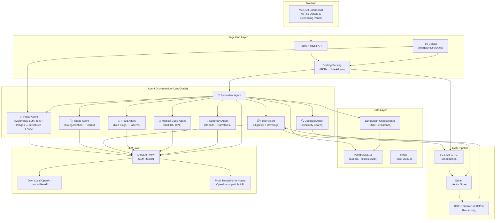

# 🏥 Multi-Agent Insurance Claims Intake System


A production-grade, self-hosted multi-agent system that processes incoming First Notice of Loss (FNOL) incident reports — submitted as **unformatted text and images** — and cross-references them against retrieved policy terms using a LangGraph-orchestrated pipeline.

## ✨ Features

- 🤖 **Multi-Agent Orchestration**: Powered by LangGraph, featuring a Supervisor agent routing tasks to specialized agents (Intake, Triage, Policy, Fraud, Medical, Summary, and Duplicate Detection).
- 👁️ **Multimodal FNOL Intake**: A vision-capable model behind an OpenAI-compatible API processes raw text narratives and base64-encoded incident images (handwritten notes, damage photos) without external OCR engines.
- 📄 **Advanced Document Parsing**: Uses **Docling** to accurately convert complex, multi-page PDF insurance policies into semantically rich Markdown for optimal RAG ingestion.
- 🧠 **Precision RAG Pipeline**: Local embeddings (BGE-M3) and two-stage reranking (BGE-Reranker-v2) on CPU, backed by **Qdrant** for high-performance vector similarity search.
- 🚦 **Human-in-the-Loop (HITL)**: Built-in routing for manual adjuster review on low-confidence extractions or high fraud risk assessments.
- 📊 **Vue.js 3 Dashboard**: A modern frontend with drag-and-drop file uploads, real-time agent reasoning inspection, audit timelines, and analytical metrics.
- 🐳 **Fully Containerized**: Deployable via Docker Compose with Postgres, Qdrant, Redis, and LiteLLM Proxy included.

## 🏗️ Architecture


```mermaid
graph TB
    subgraph "Ingestion Layer"
        API["FastAPI REST API"]
        UP["File Upload<br/>(Images/PDFs/Docs)"]
        DOC["Docling Parsing<br/>(PDFs → Markdown)"]
    end

    subgraph "Agent Orchestration (LangGraph)"
        SUP["🧠 Supervisor Agent"]
        INT["📄 Intake Agent<br/>(Multimodal LLM: Text + Images → Structured FNOL)"]
        TRI["🏷️ Triage Agent<br/>(Categorization + Priority)"]
        POL["📋 Policy Agent<br/>(Eligibility + Coverage)"]
        FRD["🚨 Fraud Agent<br/>(Red Flags + Patterns)"]
        MED["🏥 Medical Code Agent<br/>(ICD-10 / CPT)"]
        SUM["📝 Summary Agent<br/>(Reports + Narratives)"]
        DUP["🔍 Duplicate Agent<br/>(Similarity Search)"]
    end

    subgraph "RAG Pipeline"
        EMB["BGE-M3 (CPU)<br/>Embeddings"]
        QDR["Qdrant<br/>Vector Store"]
        RRK["BGE-Reranker-v2 (CPU)<br/>Re-ranking"]
    end

    subgraph "Data Layer"
        PG["PostgreSQL 16<br/>(Claims, Policies, Audit)"]
        CHK["LangGraph Checkpointer<br/>(State Persistence)"]
        RDS["Redis<br/>(Task Queue)"]
    end

    subgraph "LLM Layer"
        LIT["LiteLLM Proxy<br/>(LLM Router)"]
        DEV["Dev: Local OpenAI-compatible API"]
        PROD["Prod: Hosted or In-House<br/>OpenAI-compatible API"]
    end

    subgraph "Frontend"
        VUE["Vue.js 3 Dashboard<br/>(w/ File Upload & Reasoning Panel)"]
    end

    API --> DOC
    UP --> DOC
    UP --> INT
    DOC --> SUP
    SUP --> INT
    SUP --> TRI
    SUP --> POL
    SUP --> FRD
    SUP --> MED
    SUP --> SUM
    SUP --> DUP

    POL --> EMB --> QDR
    QDR --> RRK --> POL
    DUP --> QDR
    
    DOC --> EMB

    INT --> LIT
    TRI --> LIT
    POL --> LIT
    FRD --> LIT
    MED --> LIT
    SUM --> LIT
    SUP --> LIT
    LIT --> DEV
    LIT --> PROD

    SUP --> PG
    SUP --> CHK
    CHK --> PG

    VUE --> API
```

The system is divided into several robust layers:

1. **Ingestion Layer**: FastAPI REST API handling multipart uploads (FNOL images, Policy PDFs) and Docling document parsing.
2. **Agent Orchestration**: LangGraph StateGraph utilizing a Command-based routing pattern to isolate context and manage state dynamically.
3. **LLM Gateway**: LiteLLM Proxy routes requests to a configurable OpenAI-compatible API, with its base URL, model ID, and API key supplied through environment variables.
4. **Data Layer**: PostgreSQL 16 (relational data, LangGraph checkpoints, audit events) + Redis (Celery task queue broker for asynchronous agent execution).

## 🗂️ Project Structure

```text
InsuranceAgent/
├── backend/            # FastAPI, LangGraph agents, RAG pipeline, DB models
├── frontend/           # Vue.js 3, Vite, Pinia dashboard application
├── litellm/            # LLM routing configuration
├── scripts/            # Database seeding and Docling PDF ingestion scripts
└── docs/               # API, Agent, and Deployment documentation
```

## 🚀 Getting Started

*(Note: The codebase is currently under active development. Ensure you have Docker and Docker Compose installed.)*

### Prerequisites

- Docker & Docker Compose
- Python 3.11+ (for local backend development)
- Node.js 22.12+ (for local frontend development)
- An OpenAI-compatible API and its model ID; image intake requires a vision-capable model

For upstream API configuration, follow
[the LiteLLM setup instructions](docs/deployment.md). The proxy exposes the
`claims-model` alias used by all agent settings. Set `LLM_API_BASE`,
`LLM_MODEL`, and `LLM_API_KEY` to switch the upstream without changing code.

### Installation

1. **Clone the repository:**
   ```bash
   git clone https://github.com/yourusername/ai-claims-intake.git
   cd ai-claims-intake
   ```

2. **Configure Environment Variables:**
   ```bash
   cp .env.example .env
   # Edit .env with your specific database, LLM, and upload configurations
   ```

3. **Start the Infrastructure:**
   ```bash
   docker compose up -d
   ```

4. **Run Database Migrations & Seed Data:**
   ```bash
   docker compose exec backend alembic upgrade head
   docker compose exec backend python -m scripts.seed_policies
   ```

### Access the Applications

- **Vue.js Dashboard**: `http://localhost:3000`
- **FastAPI Swagger Docs**: `http://localhost:8000/docs`
- **LiteLLM Proxy Admin**: `http://localhost:4000`
- **Qdrant Dashboard**: `http://localhost:6333/dashboard`

## 🧩 Agent Roles

Phase 2 policy ingestion and retrieval are implemented. Follow the
[policy RAG guide](docs/rag.md) to initialize Qdrant, ingest PDF policies, and
use the two-stage retriever. Phase 2 testing is pending approval.

Phase 3 adds the multimodal intake, triage, and duplicate detection workflow
with PostgreSQL checkpoints and Redis-backed Celery execution. See the
[agent guide](docs/agents.md) and [claims API guide](docs/api.md).

Phase 4 adds policy checking with RAG citations, reference-based medical coding,
fraud screening, Markdown reports, and checkpointed human review. Eligible claims
can be automatically approved; other completed assessments pause at `under_review`.
Review routes accept approvals, rejections, and explicit overrides, with durable
resume and audit records. Existing `triaged` claims can enter Phase 4 through
the claim retry route. Configure `MEDICAL_CODE_REFERENCE_PATH` for medical code
matching; without a reference catalog, medical cases require human review.
No Phase 4 tests have been run.

Phase 5 implements the Vue 3 dashboard, claim submission with image previews,
claim inspection and reports, review controls, policy metadata/PDF ingestion,
and analytics. Supporting policy and analytics API routes are now available,
and the claims register supports server search and date filters. Follow the
[frontend guide](docs/frontend.md) for local operation and Compose deployment.
The frontend production build passed. No Phase 5 tests were run.

The LangGraph topology includes the following agents, each with isolated responsibilities:

- **🧠 Supervisor**: Evaluates state and routes to the next required agent based on structured output schemas.
- **📄 Intake**: Extracts structured `FNOLData` from unformatted textual narratives and incident images.
- **🏷️ Triage**: Categorizes claims and assigns severity and priority scores.
- **🔍 Duplicate**: Checks the vector store for similar historical claims to prevent double-payouts.
- **📋 Policy**: Retrieves relevant policy terms (RAG) and determines eligibility, limits, and exclusions.
- **🏥 Medical Coder**: Matches documented conditions and procedures to configured ICD-10-CM and CPT references.
- **🚨 Fraud**: Analyzes red flags, historical patterns, and scores risk based on customizable heuristics.
- **📝 Summarizer**: Compiles all worker outputs into a comprehensive, readable executive report for adjusters.

## 📄 License

This project is licensed under the MIT License.
